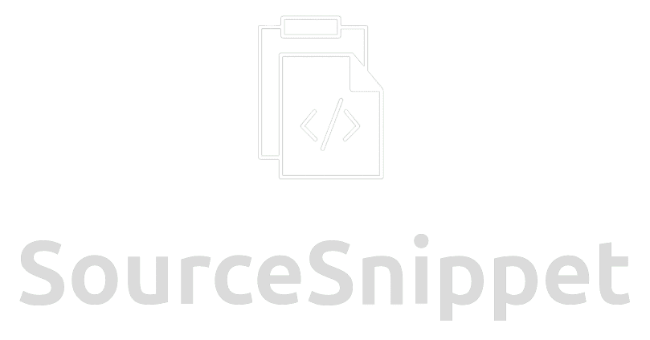
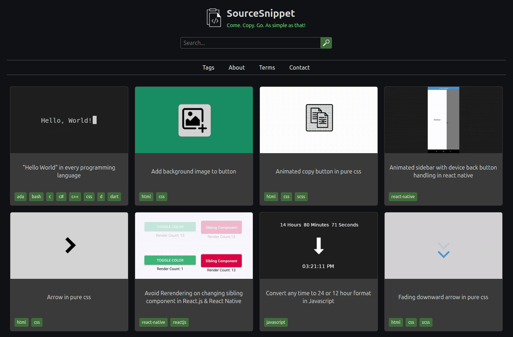

<p align="center">
  <a href="https://sourcesnippet.com" target="_blank">
    
  </a>
</p>

<p align="center">
  
  
  
</p>

<hr />

<p align="center">
A static website containing reuseable code snippets with zero fluff. 
</p>

  


## 💻 Setup Locally

1. Make sure you have [node.js](https://nodejs.org/en) installed along with npm.
1. Clone this repository:
    ```
    git clone https://github.com/sourcesnippet/sourcesnippet.github.io
    ```
1. Navigate into the repository folder:
   ```
   cd sourcesnippet.github.io
   ```
1. From the folder run the following:
    ```
    npx host-mdx
    ```
1. That's it! You should be able to see the website on `localhost:3000`.


## 🤝 Contribution

To add your own snippet do the following:

1. Create a new folder inside `snippets/` & make sure there is no whitespace in the folder name.
1. Inside the newly created folder create an `index.mdx` file  
   You can use the following template to get started:

    ```jsx
    import { Snippet } from "@/components.jsx";

    export const metaData = {
        title: 'Your title',
        thumbnail: "your-thumbnail.webp",
        author: "Your Name",
        authorWebsite: "https://yourwebsite.com/",  // Optional
        tags: ["your", "tags", "here"],
        keywords: ["your", "keywords", "here"]  // Optional, These are used purely in searching
    };

    <Snippet metaData={metaData}>

        {/* Your content goes in here */}

    </Snippet>
    ```
1. You can also create `styles.css` & `script.js` files for custom styling & scripting (They will automatically be linked).
2. Once you've created your snippet rebuild the site to make sure everything is working & follows the guidelines.


## 📜 Guidelines

1. Make sure your snippets are short and to the point (No one wants to hear your backstory).
2. Add links for any references, sources, credits at the bottom if used.
3. Make sure to give your files & folder a relevant name in `kebab-case` while avoiding words like "a", "and", "the", "is", etc.
4. Tag names should follow [stackoverflow's tags](https://stackoverflow.com/) naming convention & ideally no more than 5 tags per snippet.
5. Compress your images & gifs before adding them in your snippet. Videos have to be hosted externally and embedded into the snippet.
6. Do not add any low effort AI generated slop otherwise you will be **banned** from any further contributions.

> **Note:**  
> Before adding your own snippet take a look at existing snippets especially if you're not sure of any conventions.


## 🔑 License

MIT NON-AI © [Manas Ravindra Makde](https://manasmakde.github.io/)
