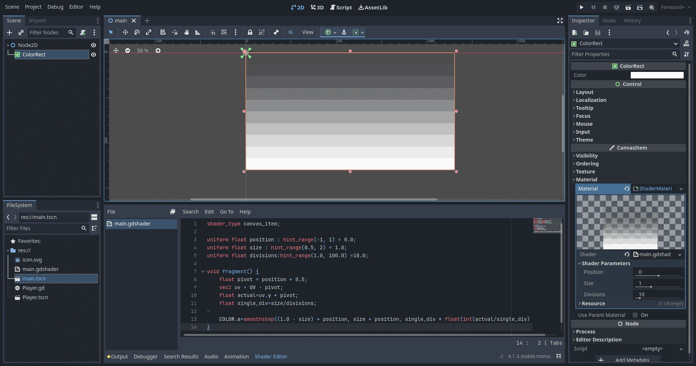

import { CodeTabs } from "@/components.jsx";


export const metaData = {
    title: 'Palette gradient shader in godot',
    thumbnail: "palette-gradient-shader.webp",
    author: "Manas R. Makde",
    authorWebsite: "https://manasmakde.github.io/",
    tags: ["godot", "shader", "godot-shader-language"]
}


```gdscript
shader_type canvas_item;

uniform float position : hint_range(-1, 1) = 0.0;
uniform float size : hint_range(0.5, 2) = 1.0;
uniform float divisions:hint_range(1.0, 100.0) =10.0;

void fragment() {
    float pivot = position + 0.5;
    vec2 uv = UV - pivot;
    float actual=uv.y + pivot;
    float single_div=size/divisions;
	
    COLOR.a=smoothstep((1.0 - size) + position, size + position, single_div * float(int(actual/single_div)));
}
```

Editor screenshot for reference:


